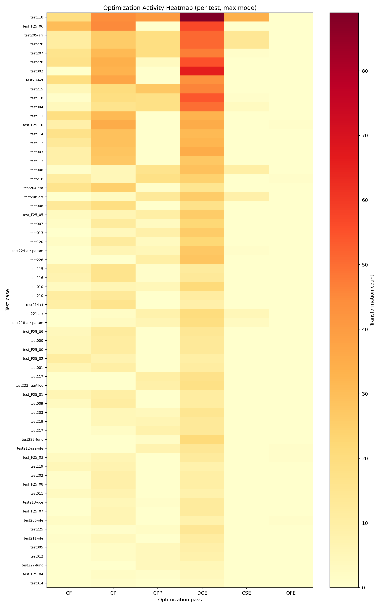

# MochaLang Optimizing Compiler

A comprehensive Java compiler that lowers a strongly-typed AST into CFG/TAC IR, converts to Static Single Assignment (SSA) form, executes an elaborate suite of optimizations, performs SSA elimination, allocates physical registers (handling register pressure via spilling), and generates final DLX machine code.

## Quick Start / Build and Run

To exercise the complete pipeline, simply run the sequence of shell scripts provided:

```bash
# Deletes old build artifacts and recompiles all Java sources
bash scripts/build.sh

# Compiles simple integration tests and checks the generated execution
bash scripts/run-smoke.sh

# Exhaustive test harness running all /tests/*.txt programs
bash scripts/run-tests.sh

# Extracts snapshots of the graph structures for visualization
bash scripts/gen-graphs.sh
```

Generated outputs—including execution logs, transformed IR, and emitted assembly—are securely isolated in `artifacts/`.

## Features

- **Robust Type Analysis**: Detects structural malformations and resolves function overloading and unreachable return paths ahead of time.
- **True SSA Architecture**: Maps the AST into proper Basic Block CFGs and inserts Phi nodes using a rigourous Dominator + Dominance Frontier algorithm.
- **Layered Optimization Pipeline**: Achieves massive code reductions sequentially evaluating Constant Folding, Constant and Copy Propagation, Dead Code Elimination, Common Subexpression Elimination, and Orphan Function Elimination.
- **Physical Feasibility**: Employs graph coloring to pack as many variables into 24 volatile/callee-save hardware registers as mathematically possible, defaulting gracefully to memory spill loads when pressure peaks.

## Architecture Internals

To read deeply about the inner workings, theory, and architecture of each phase, please consult the internal docs:

- **1.** Front-End: [`docs/architecture/parse-typecheck.md`](docs/architecture/parse-typecheck.md)
- **2.** IR Generation: [`docs/architecture/ir-generation.md`](docs/architecture/ir-generation.md)
- **3.** SSA Conversion: [`docs/architecture/ssa-conversion.md`](docs/architecture/ssa-conversion.md)
- **4.** Optimizations: Explore the individual passes in [`docs/architecture/optimization/`](docs/architecture/optimization/README.md)
- **5.** SSA Elimination: [`docs/architecture/ssa-elimination.md`](docs/architecture/ssa-elimination.md)
- **6.** Register Allocation: [`docs/architecture/register-allocation.md`](docs/architecture/register-allocation.md)
- **7.** Machine Code Generation: [`docs/architecture/code-generation.md`](docs/architecture/code-generation.md)

## Test Examples and Demonstration

Curious to see what the generated DLX code actually looks like before and after optimizations kick in?
Take a look at the compiled snippets in **[docs/examples.md](docs/examples.md)**.

## Built Artifacts

The backend outputs several forensic artifacts useful when debugging compiler faults:

- CFG physical snapshots: `artifacts/graphs/`
- TAC mutation logs: `artifacts/records/`
- Emitted Assembly: `artifacts/asm/`
- MochaLang test runner log: `artifacts/logs/test-summary.txt`

## Optimization Metrics

Across 64 tests, generated DLX code size dropped from 4813 to 3286 instructions (**31.73% overall reduction**).

### Pass Activity Heatmap



### Code-Size Reduction


## Known Limitations

Software of this complexity inherently carries some architectural trade-offs:

- **Call save/restore precision**: The policy in codegen acts at the function-level, prioritizing semantic safety over perfectly precise call-site saving.
- **Conservative global sync**: Globals are forced to memory before function calls because the compiler does not compute aggressive inter-procedural alias summaries.
- **Spill register friction**: Spill rewriting assumes variables can always transiently borrow the scratch registers (`R26`, `R27`). Instructions taking extreme numbers of simultaneous spilled inputs may bottleneck.
- **Lexer edge case**: One obscure fixture (`test220`) remains sensitive to a missing input token stream inside `DLX.nextInput()`.
