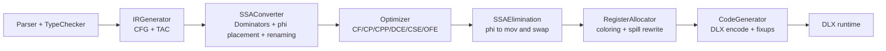

# MochaLang Optimizing Compiler

A Java compiler pipeline that lowers AST to CFG/TAC IR, converts to SSA, runs optimization passes, allocates registers with spilling, and emits DLX assembly.

## Quick Start

```bash
bash scripts/build.sh
bash scripts/run-smoke.sh
bash scripts/run-tests.sh
bash scripts/gen-graphs.sh
```

Generated outputs are written to `artifacts/`.

## Compiler Data Path



## Where The Core Logic Lives

- IR generation and lowering rules: `compiler/src/ir/IRGenerator.java`
- SSA conversion + dominators: `compiler/src/ir/ssa/SSAConverter.java`
- Register allocation + spill rewriting: `compiler/src/ir/regalloc/RegisterAllocator.java`
- SSA elimination: `compiler/src/ir/regalloc/SSAElimination.java`
- Machine code emission + calling convention: `compiler/src/ir/codegen/CodeGenerator.java`
- Runtime machine model: `compiler/src/mocha/DLX.java`

## Architecture

- Pipeline index: `docs/architecture/pipeline.md`
- Parse and type-check: `docs/architecture/parse-typecheck.md`
- IR generation: `docs/architecture/ir-generation.md`
- SSA conversion: `docs/architecture/ssa-conversion.md`
- Optimization: `docs/architecture/optimization.md`
- SSA elimination: `docs/architecture/ssa-elimination.md`
- Register allocation: `docs/architecture/register-allocation.md`
- Code generation: `docs/architecture/code-generation.md`
- DLX runtime execution: `docs/architecture/dlx-runtime.md`
- Limitations register: `docs/architecture/limitations.md`

## Artifacts

- CFG snapshots: `artifacts/graphs/`
- Transformation logs: `artifacts/records/`
- Assembly output snapshots: `artifacts/asm/`
- Test summary: `artifacts/logs/test-summary.txt`

Example signals from current artifacts:
- `artifacts/records/record_test209-cf_cf.txt` shows algebraic simplification rewrites.
- `artifacts/asm/test209-cf_asm.txt` shows folded constants emitted directly as immediates.

## Limitations

- Historical docs still reference an extra memory-promotion phase that is not present in the current pipeline.
- Call save/restore policy in codegen is function-level and not call-site precise.
- Global state synchronization around calls is conservative and can over-serialize loads/stores.
- Spill rewriting assumes limited scratch-register scenarios and can fail on complex instructions.

See `docs/architecture/limitations.md` for details, impact, and cleanup strategy.
