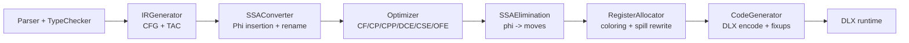

# MochaLang Optimizing Compiler

A Java compiler pipeline that lowers AST to CFG/TAC IR, converts to SSA, runs optimization passes, allocates registers with spilling, and emits DLX assembly.

## Quick Start

```bash
bash scripts/build.sh
bash scripts/run-smoke.sh
bash scripts/run-regression.sh
bash scripts/gen-graphs.sh
```

Generated outputs are written to `artifacts/` (ignored by git).

## Compiler Data Path



## Where The Core Logic Lives

- IR generation and lowering rules: `compiler/src/ir/IRGenerator.java`
- Register allocation + spill rewriting: `compiler/src/ir/regalloc/RegisterAllocator.java`
- SSA destruction: `compiler/src/ir/regalloc/SSAElimination.java`
- Machine code emission + calling convention: `compiler/src/ir/codegen/CodeGenerator.java`

## Deep-Dive Docs

- Pipeline internals: `docs/architecture/pipeline.md`
- IR generator deep dive: `docs/architecture/ir-generator-deep-dive.md`
- Code generator deep dive: `docs/architecture/codegen-deep-dive.md`
- Technical debt register: `docs/architecture/technical-debt.md`
- Optimization pass behavior: `docs/optimizations/passes.md`
- Report culmination index: `docs/reports/index.md`

## Concrete Evidence

- CFG snapshots: `artifacts/graphs/`
- Transformation logs: `artifacts/records/`
- Assembly output snapshots: `artifacts/asm/`
- Regression summary: `artifacts/logs/regression-summary.txt`

Example signals from current artifacts:
- `artifacts/records/record_test209-cf_cf.txt` shows algebraic simplification rewrites.
- `artifacts/asm/regression/test209-cf_asm.txt` shows folded constants emitted directly as immediates.

## Technical Debt (Top-Level)

- SSA conversion is present, but there is no explicit Mem2Reg stage despite historical documentation references.
- Call save/restore policy in codegen is function-level and not call-site precise.
- Global state synchronization around calls is conservative and can over-serialize loads/stores.
- Spill rewriting assumes limited scratch-register scenarios and can fail on complex instructions.

See `docs/architecture/technical-debt.md` for details, impact, and cleanup strategy.
