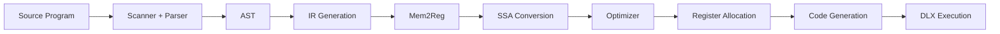
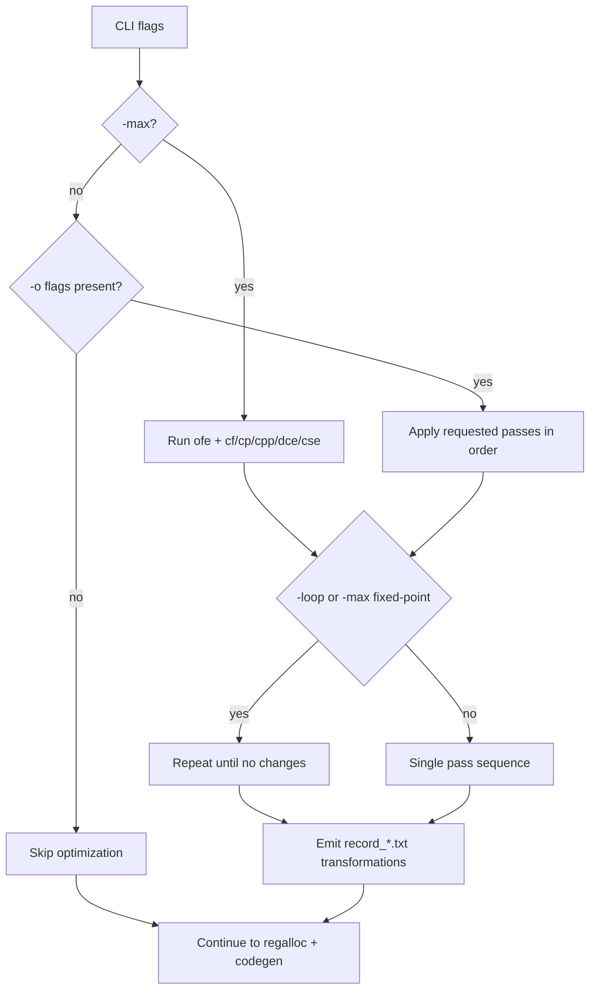
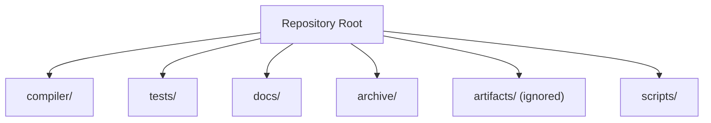

# MochaLang Optimizing Compiler

A Java-based compiler toolchain for a small imperative language with SSA construction, multiple optimization passes, register allocation, and DLX code generation.

## Overview

This repository is organized as an engineering portfolio project:
- `compiler/src`: compiler implementation (`mocha.CompilerTester` entrypoint)
- `tests`: regression, optimization, and fixture inputs
- `docs`: architecture notes, optimization notes, and report culmination
- `archive`: historical material and starter snapshots
- `artifacts`: generated outputs (records/graphs/asm/logs; gitignored)

## Pipeline



## Optimization Control Flow



## Repository Architecture



## Quick Commands

```bash
# compile
bash scripts/build.sh

# smoke test
bash scripts/run-smoke.sh

# regression sweep (set LIMIT=10 for first 10)
bash scripts/run-regression.sh

# generate CFG graph artifacts
bash scripts/gen-graphs.sh
```

## Key Components

- SSA path: `compiler/src/ir/IRGenerator.java`, `compiler/src/ir/ssa/SSAConverter.java`
- Optimization framework: `compiler/src/ir/optimizations/Optimizer.java`
- Passes: CF, CP, CPP, DCE, CSE, OFE
- CLI entrypoint: `compiler/src/mocha/CompilerTester.java`

## Reports and Evidence

- Architecture deep dive: `docs/architecture/pipeline.md`
- Optimization notes: `docs/optimizations/passes.md`
- Culminated report index: `docs/reports/index.md`
- Executive summary: `docs/reports/executive-summary.md`
- Verification matrix: `docs/reports/verification-matrix.md`
- Raw legacy reports: `docs/reports/raw/`
- Final written report (PDF): `docs/final-report/final-report.pdf`
