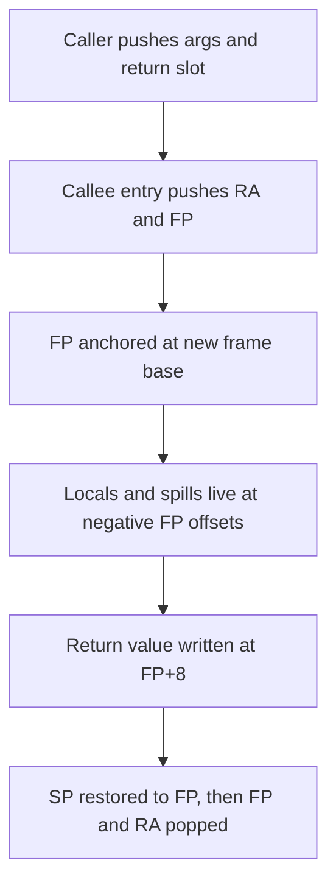
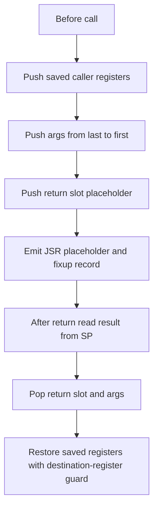
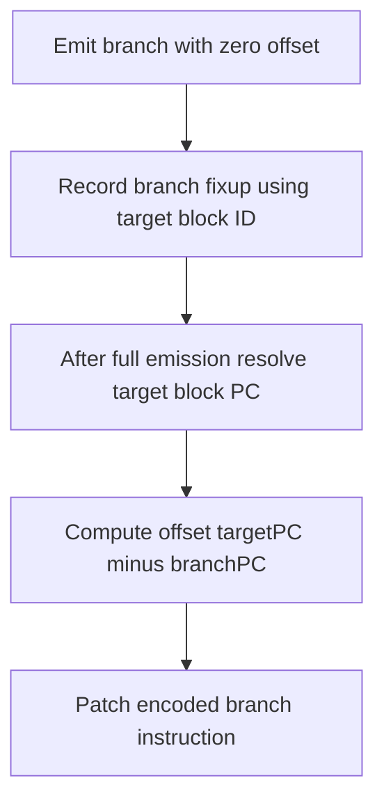

# Code Generation Internals

This stage lowers register-allocated TAC into DLX machine instructions and resolves unresolved control-transfer targets.

Primary file: `compiler/src/ir/codegen/CodeGenerator.java`

## Backend Model And Reserved Registers

Hard-wired conventions in this backend:

- `R28 = FP`
- `R29 = SP`
- `R30 = GP`
- `R31 = RA`
- `R25` is scratch for immediate materialization in many lowering paths.
- `R26` and `R27` are reserved for spill machinery; codegen avoids using them as general arithmetic temps.

Generated code assumes prior register allocation mapped TAC variables to concrete `R#` names.

## Function Prologue/Epilogue And Stack Contract

Every function, including `main`, uses the same frame contract.

### Prologue emitted at function entry

1. `PSH RA, SP, -4`
2. `PSH FP, SP, -4`
3. `FP = SP`
4. `SP -= frameSize` (if frame size is non-zero)

### Return path

If there is a return value, it is stored to `FP+8`. Then epilogue runs:

1. `SP = FP`
2. `POP FP, SP, 4`
3. `POP RA, SP, 4`
4. `RET RA`

## Call Lowering: Exact Stack Behavior

`generateCall` performs five phases.

1. Save registers selected from `functionLiveRegs[targetFunction]`.
2. Push call arguments right-to-left.
3. Push one 4-byte return slot placeholder.
4. Emit `JSR` placeholder and register a call fixup.
5. On return:
   - load return value from `SP+0` into destination register (if call has destination)
   - pop return slot + args by `ADDI SP, SP, 4 + 4*argCount`
   - restore saved regs in reverse push order

Special handling prevents overwriting call result when destination register was also in saved set.

## CFG Emission Order And Fallthrough Control

Block order is chosen to favor branch fallthrough:

- `getFallthroughSuccessor` identifies the non-branch target successor for conditional blocks.
- Worklist scheduling pushes fallthrough blocks to the front and branch targets to the back.
- This minimizes unnecessary jump distance and keeps branch logic aligned with CFG intent.

## Branch Lowering And Fixup Mechanics

Branches are emitted before absolute target instruction addresses are known.

### During initial emission

- Branch TAC (`Beq/Bne/Blt/Ble/Bgt/Bge/Bra`) emits placeholder offset `0`.
- A `BranchFixup` entry stores:
  - branch instruction PC
  - target block ID
  - opcode
  - condition register

### During `applyFixups`

- Resolve target block PC via `blockPCMap`.
- Compute relative branch offset:
  - `offset = targetPC - branchInstrPC`
- Reassemble instruction word with final offset.

This is the critical mechanism that decouples CFG traversal order from final branch correctness.

## Call Fixup Mechanics

Call targets are also unknown until all function entry PCs are assigned.

- Initial call emission writes `JSR 0` and records `{instrPC, targetFunctionSymbol}`.
- After all functions are emitted:
  - lookup function start PC from `functionPCMap`
  - patch instruction with absolute DLX address form: `JSR(targetPC * 4)`

Function symbol identity is used directly, which supports overload-distinct targets.

## Comparison Lowering Details

`Cmp` lowering emits integer or float compare ops first, then converts tri-state compare result (`-1/0/1`) into strict boolean 0/1 through bit/arithmetic normalization sequences.

Examples:

- `eq`: mask low bit then invert.
- `lt`: arithmetic shift to isolate sign.
- `le/ge/gt`: arithmetic adjustments followed by shifts.

This keeps branch consumers operating on normalized boolean values.

## Memory And Address Instruction Selection

- `LoadFP`, `LoadGP` become base+offset `LDW` from `FP`/`GP`.
- `AddaFP`, `AddaGP`, `Adda` lower pointer arithmetic for locals/globals/computed addresses.
- `Load` and `Store` support immediate materialization through scratch register fallback.

Array/address TAC from IR stage therefore maps directly to DLX address math without changing semantic structure.

## Output Contract

The final output is an `int[]` DLX program where:

- all blocks/functions have concrete machine PCs,
- all branch/call placeholders are patched,
- stack frame and call conventions are consistent across every function,
- code is executable by `DLX.load` + `DLX.execute`.
