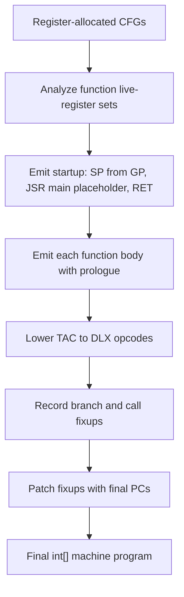
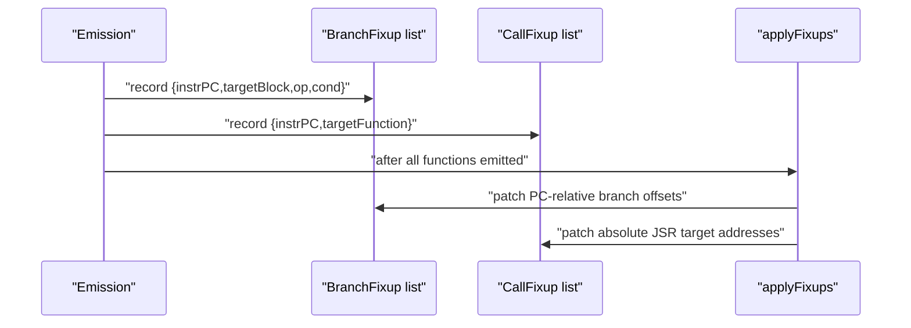

# Code Generation

This stage lowers register-allocated TAC into DLX instructions, then patches unresolved branch and call targets.

File focus: `compiler/src/ir/codegen/CodeGenerator.java`

## Backend Emission Flow

## Frame And Calling Convention

- Reserved registers: `R28=FP`, `R29=SP`, `R30=GP`, `R31=RA`.
- Function prologue: push `RA`, push `FP`, set `FP=SP`, allocate frame.
- Return value slot is at `FP+8`.
- Calls push args right-to-left, then push return slot placeholder, then `JSR`.
- Function epilogue restores `SP`, pops `FP`, pops `RA`, and returns.

## Instruction Selection Details

- Binary ops choose immediate vs register forms (`ADDI` vs `ADD`, etc.).
- Float immediates map to float opcode variants (`fADDI`, `fCMPI`).
- Compare lowering converts DLX compare tri-state outputs into strict booleans.
- Address TAC (`Adda`, `AddaGP`, `AddaFP`) becomes pointer arithmetic rooted at `FP` or `GP`.
- Eliminated TAC instructions are skipped entirely.

## Branch And Call Fixups

- Branch instructions are emitted with placeholder offset 0 and tracked by block ID.
- Call instructions are emitted as placeholder `JSR 0` and tracked by function symbol.
- Final patch step resolves block/function PCs and rewrites instruction words.

## Output Contract

- Returns `int[]` DLX machine program ready for runtime `DLX.load` + `DLX.execute`.
- Branch and call references are fully resolved.
- Code respects frame/stack conventions expected by generated calls and returns.

## Practical Insights

- Block scheduling prefers fallthrough successors first to reduce branch distance and improve readability.
- Save/restore selection in `generateCall` is based on function-level register usage sets, which is conservative relative to call-site liveness.
- Backend assumes allocator already mapped non-immediate operands to `R#`; unmapped variables are treated as hard errors.
