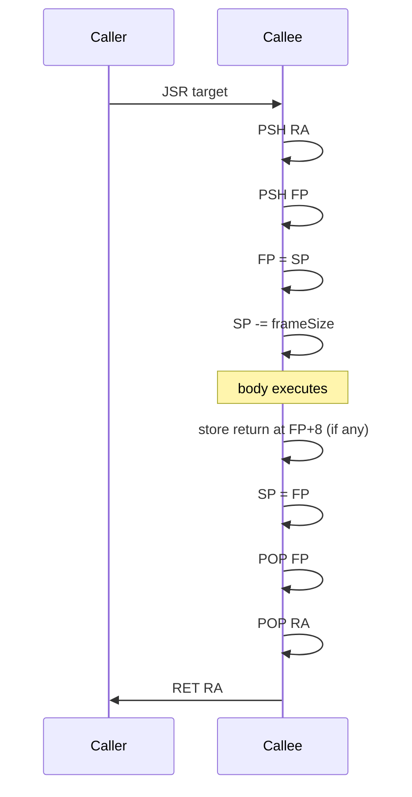
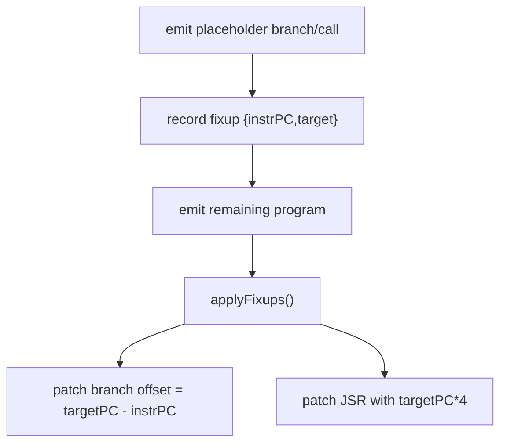

# CodeGenerator Deep Dive

File: `compiler/src/ir/codegen/CodeGenerator.java`

`CodeGenerator` lowers register-allocated TAC into DLX instructions and patches branch/call targets.

## Register and Frame Conventions

- `R0`: constant zero
- `R28`: FP
- `R29`: SP
- `R30`: GP
- `R31`: RA
- `R25`: general scratch/immediate materialization
- `R26/R27`: reserved for spill support

## Function Prologue/Epilogue

## Block Scheduling and Fallthrough

The generator tries to emit fallthrough successor first for conditional branches so branch offsets stay minimal and layout is readable.
It still records all branch fixups and resolves exact offsets after full emission.

## Branch and Call Fixups

## Instruction Lowering Patterns

- Binary ops use reg-op vs imm-op forms (`ADD` vs `ADDI`, etc.).
- Float immediates map to float opcodes (`fADDI`, `fCMPI`, ...).
- `Cmp` emits compare then normalizes result to boolean 0/1 by op-specific bit arithmetic.
- Address ops (`Adda`, `AddaGP`, `AddaFP`) convert symbolic offsets into pointer arithmetic.
- `Mov immediate` infers float vs int from value type.

## Call Lowering

Current implementation:
1. saves selected registers
2. pushes args right-to-left
3. pushes return slot placeholder
4. emits `JSR` fixup
5. loads return value from stack top into destination register
6. pops args + return slot
7. restores saved registers (skips overwrite when destination register matches)

## Assembly Evidence

`artifacts/asm/regression/test209-cf_asm.txt` contains immediate writes only for folded constants:
- `ADDI 25 0 2`
- `ADDI 25 0 3`
- `ADDI 25 0 7`

That confirms constant-folded values are materialized directly at codegen.

## Technical Debt In This File

- Save-set selection in `generateCall` uses callee-level live-register set, not caller call-site liveness.
- Scratch register policy (`R25` globally reused) increases coupling across lowering cases.
- Error handling is fail-fast runtime exceptions on unsupported TAC; no graceful diagnostics.
- Main bootstrap and function emission share logic; clearer separation would ease ABI evolution.
