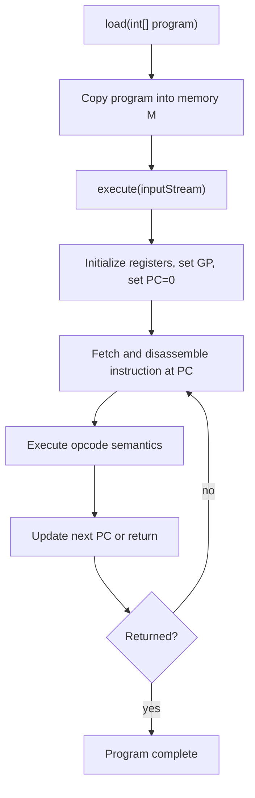

# DLX Runtime Execution

This stage executes emitted machine code in the DLX emulator and produces observable program output.

File focus: `compiler/src/mocha/DLX.java`

## Runtime Loop

## Execution Model Details

- Memory is integer-word addressed (`MEM_SIZE/4` words).
- `R30` (`GP`) is initialized to top-of-memory anchor.
- `R0` is forced to zero each iteration.
- Decode path distinguishes instruction formats and resolves immediate/register operand `c`.
- Branches update `nextPC` relative to current `PC`; `JSR`/`RET` use byte-addressed return semantics.

## I/O Semantics

- `RDI`, `RDF`, `RDB` consume tokenized input via `nextInput`.
- `WRI`, `WRF`, `WRB`, `WRL` print integer/float/bool/newline outputs.
- Input is token-based, not line-structured; missing tokens propagate as runtime failures.

## Error Paths

- Invalid arithmetic/shift/branch-address conditions call runtime `bug()` paths.
- `ArrayIndexOutOfBoundsException` during execution dumps failing instruction context.
- Input parsing errors are rethrown with current input line metadata.

## Output Contract

- Side effects: stdout/stderr output, register/memory state transitions.
- Terminates on explicit return from startup sequence (`RET R0`) or runtime fatal path.

## Practical Insights

- Runtime behavior is strict and low-level; many malformed states fail hard by design.
- Because input is tokenized through `StringTokenizer`, fixture quality directly impacts regression reliability.
- Float support relies on encoded bit patterns in integer registers, so codegen float immediate handling must stay consistent with DLX decode/execute rules.
