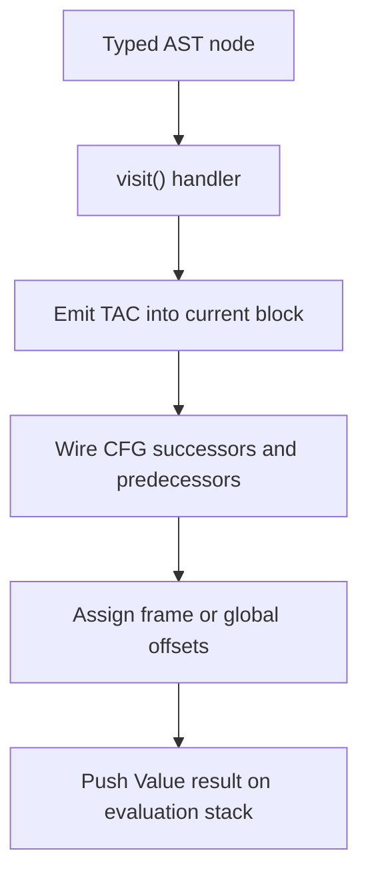

# IR Generation

This stage lowers typed AST into CFG plus TAC while assigning concrete stack/global storage layout.

File focus: `compiler/src/ir/IRGenerator.java`

## Core Responsibilities

- Build `CFG`/`BasicBlock` structure per function.
- Emit TAC instructions with stable IDs.
- Compute and assign `fpOffset` and `gpOffset` memory layout.
- Lower arrays, branches, loops, calls, and expression trees.
- Track initialization state and inject default-init logic.

## Lowering Pipeline

## Expression And Addressing Strategy

- Binary expressions evaluate children, then use `loadIfNeeded` before TAC emission.
- Commutative ops (`Add`, `Mul`) bias immediates to the right operand.
- Non-commutative ops materialize immediate-left values into temps when required.
- `ArrayIndex` lowering uses address arithmetic (`Adda`, `AddaFP`, `AddaGP`) and delays `Load` for intermediate dimensions.

## Control-Flow Construction

- Conditionals emit explicit branch TAC and explicit CFG edges.
- Loop shapes (`while`, `repeat`) are built with named header/body/exit blocks and explicit back-edges.
- CFG edge lists are maintained alongside branch instructions so dominator and liveness passes operate on consistent topology.

## Call Semantics At IR Level

- Call lowering emits argument evaluation and a `Call` TAC with destination temp.
- Around calls, global-state synchronization is conservative (`storeUsedGlobals` and reload path), prioritizing correctness over minimal traffic.

## Output Contract

- A list of function CFGs with valid entry blocks and instruction IDs.
- Variables still symbolic (`Variable`) and not mapped to physical registers.
- Control flow represented both structurally (CFG links) and operationally (branch TAC).

## Non-Obvious Tradeoffs

- This class currently combines layout planning, diagnostics, CFG construction, and expression lowering, which accelerates implementation but increases coupling.
- Initialization tracking mutates symbol state during reads, so it doubles as both diagnostics and codegen policy.
- The IR stage commits memory offsets early; all backend stages depend on those offsets remaining stable.
