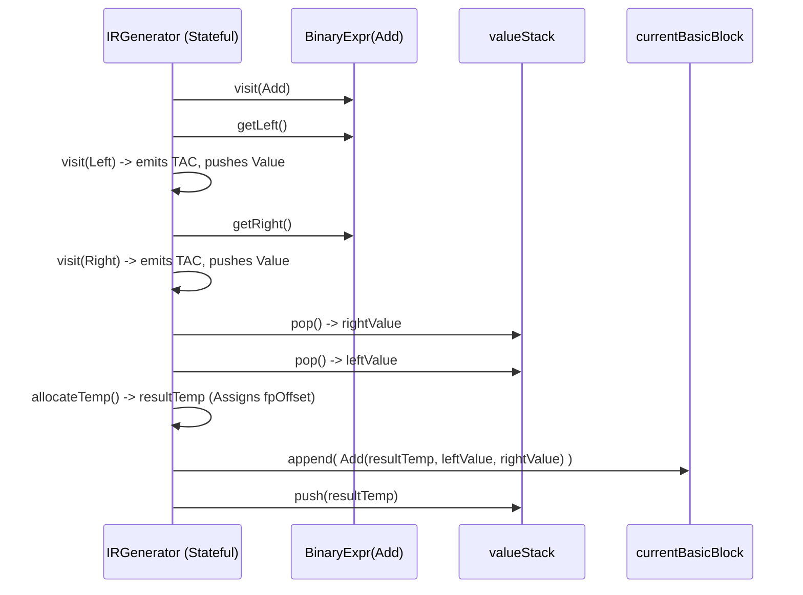
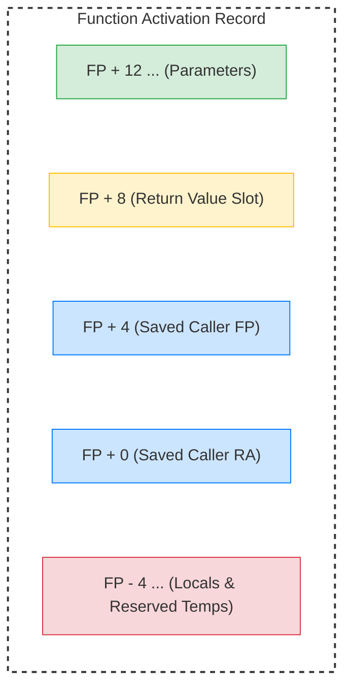
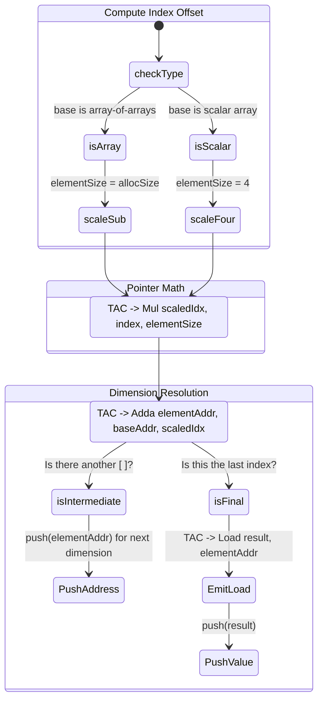

# IR Generation Internals

## The Essence of IR Generation

The essence of IR Generation is **linearization and layout realization**. It transforms nested, tree-like expressions into a flat sequence of atomic operations (Three-Address Code) and explicit control flow (CFG). This phase forces the compiler to answer hard physical questions: "exactly where in memory does this variable live?" and "exactly how many bytes does this array indexing jump?". The complexity arises from maintaining synchronized state—tracking the evaluation stack, calculating precise stack frame offsets, and generating strict branch instructions—while dismantling high-level constructs into low-level steps.

This stage lowers typed AST into CFG + TAC while fixing concrete memory layout decisions (global offsets, frame offsets, parameter slots, temp slots).

Primary file: `compiler/src/ir/IRGenerator.java`

## Core State That Drives Lowering

`IRGenerator` is stateful and correctness depends on these structures being synchronized:

- `currentCFG`, `currentBlock`: where newly emitted TAC lands.
- `valueStack`: expression evaluation stack of `Value` objects.
- `freeTemps`: recycled temporaries (`$tN`) with frame slots.
- `fpOffset`, `gpOffset`, `paramOffset`: storage layout cursors.
- `initialized*` and `needsDefaultInit*` sets: uninitialized-use warnings and deferred entry initialization.
- `usedGlobalsInFunction`: gates global load/store insertion around calls and function entry.

## Storage Layout Decisions

### Global layout

Global offsets are assigned before function lowering (`assignGlobalOffsets`):

- Offset base is `GP`-relative, growing downward (`gpOffset -= size`).
- Scalar globals reserve `4` bytes.
- Arrays reserve `4 + allocationSize` bytes.
  - The first `4` bytes conceptually represent an address slot.
  - Data area starts at `globalOffset + 4`.

### Function frame layout

For each function:

- `paramOffset` starts at `12`.
  - `FP+8` is reserved for return value.
  - `FP+4` and `FP+0` are occupied by saved frame metadata in codegen convention.
- Parameters get positive offsets (`FP+12`, `FP+16`, ...).
- Locals and temps allocate negative offsets (`fpOffset -= size`).
- Final frame size is `abs(fpOffset)` and exported to CFG for codegen stack allocation.

## Expression Lowering Rules

### Value materialization policy

`loadIfNeeded` distinguishes between symbolic variables and already-materialized temps:

- Non-temp variable reads stay symbolic for later register allocation/codegen.
- First read of uninitialized variable triggers warning and adds symbol to deferred default-init set.
- Temps are treated as already materialized SSA-like temporaries.

### Immediate handling policy

- Commutative ops (`Add`, `Mul`) may reorder operands when left side is immediate.
- Non-commutative ops (`Sub`, `Div`, `Mod`, `Pow`, `Cmp`) force immediate-left into a temp register first.
- `LogicalAnd` and `LogicalOr` currently lower to eager binary TAC (`And`, `Or`) without short-circuit CFG splitting.

## Array Lowering: Address Arithmetic And Dimension Semantics

Array lowering is one of the densest parts of the compiler.

### Base address formation

For `Designator` on arrays:

- Global array base: `AddaGP(base, globalOffset, 4)`.
- Local array base: `AddaFP(base, fpOffset, 4)`.
- Array parameters are already addresses loaded from parameter slots.

### Index scaling and multi-dimensional traversal

For `ArrayIndex(base, index)`:

1. Compute `elementSize` from `base` type.
   - If indexing into an array-of-arrays, scale by subarray allocation size.
   - Final scalar dimension uses scale `4`.
2. Compute `scaledIndex = index * elementSize` (fold immediate when possible).
3. Compute `elementAddr = baseAddr + scaledIndex`.
4. If intermediate access (e.g., first index in `a[i][j]`), push address.
5. If final access, emit `Load` from `elementAddr` and push value.

Assignment to arrays mirrors the exact same addressing path, then performs `Store` or read-modify-write for compound operators.

## Control-Flow Construction Details

### `if`

- Condition lowers to value `cond`.
- Emit `Beq(cond, falseTarget)` where zero means false.
- Emit explicit `Bra(thenBlock)` after the conditional branch.
- This explicit branch keeps semantics correct even if later block scheduling reorders physical block emission.

### `while`

- Emit jump to `loopHeader` first.
- Header evaluates condition and branches to `loopExit` on false, otherwise branches to `loopBody`.
- Body ends with back-edge `Bra(loopHeader)`.

### `repeat`

- Enters body directly.
- After body condition evaluation: `Bne(cond, exit)` then `Bra(body)`.
- CFG predecessors/successors are updated from the actual block that contains the branch terminators.

## Call Lowering And Global Synchronization

For non-builtin calls:

1. Evaluate args and preserve array arguments as addresses.
2. `storeUsedGlobals()` before call.
3. Emit `Call(dest, functionSymbol, args)`.
4. Reload globals via `loadAllGlobals()` after call.

This is conservative but keeps global state coherent across calls without alias summaries.

## Deferred Default Initialization Injection

The stage does not always emit default initialization when variable is declared. Instead:

- First suspicious read adds variable to `needsDefaultInit*`.
- After body lowering, generated init instructions are moved into function entry block at insertion point.

Special case for `main`:

- Used scalar globals are explicitly initialized via `Mov 0` / `Mov 0.0` at entry.
- This gives optimization passes concrete initial constants instead of unknown loaded memory.

## Output Contract

The result is a list of CFGs where each function has:

- Consistent block graph and branch TAC targets.
- Concrete symbol offsets for globals/params/locals/temps.
- TAC for all expression, memory, control, and call semantics.
- Entry-sequenced global/param/default-init setup compatible with SSA conversion and later backend stages.
