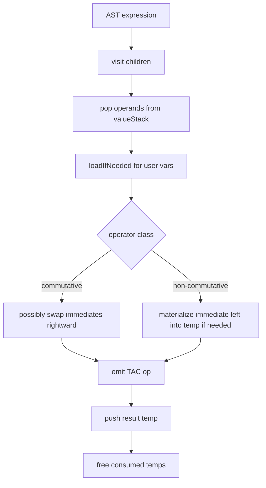
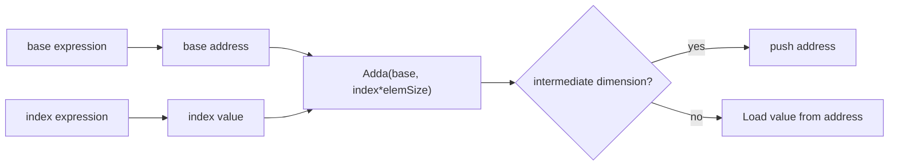

# IRGenerator Deep Dive

File: `compiler/src/ir/IRGenerator.java`

`IRGenerator` is the main lowering engine from AST to CFG+TAC.

## State It Maintains

- instruction IDs and block IDs (`instructionCounter`, `blockCounter`)
- frame/global layout (`fpOffset`, `gpOffset`, `paramOffset`)
- temp lifecycle (`freeTemps`, `nextTempNumber`)
- initialization tracking (`initializedGlobals/Locals`, `needsDefaultInitGlobals/Locals`)
- per-CFG global side-effect tracking (`usedGlobalsInFunction`)
- current CFG cursor (`currentCFG`, `currentBlock`)
- expression evaluation stack (`valueStack`)

## Memory Model Decisions

- Scalar globals are addressed by `GP + globalOffset` via `LoadGP`/`StoreGP`.
- Arrays reserve slot + payload (`4 + allocationSize`) in global/local frame layout.
- Local/temporary storage grows downward by decrementing `fpOffset`.

## Expression Lowering Strategy

Notable details:
- `Addition`/`Multiplication` try to keep immediate on the right operand.
- `Subtraction`/`Division`/`Modulo`/`Power` materialize immediate-left operands first.
- Current `LogicalAnd`/`LogicalOr` use direct `And`/`Or`; short-circuit logic exists only as disabled code.

## Array Addressing

`visit(ArrayIndex)` computes:
- `scaledIndex = index * elementSize`
- `elementAddr = baseAddr + scaledIndex`

For intermediate multi-dimensional access, it pushes address only; final dimension emits `Load`.

## Control-Flow Lowering

- `IfStatement`: emits `Beq cond falseTarget` + explicit `Bra thenBlock`.
- `WhileStatement`: builds header/body/exit blocks with explicit loop-back `Bra`.
- `RepeatStatement`: uses post-body condition and `Bne cond exit` + `Bra body`.

CFG edges are manually added alongside branch TAC to keep analysis/codegen consistent.

## Function Calls at IR Level

For user-defined calls:
1. evaluate arguments
2. preserve global state via `storeUsedGlobals()`
3. emit `Call(dest, symbol, args)`
4. restore globals via `loadAllGlobals()`

This is intentionally conservative for correctness with mutable globals.

## Initialization Policy

`loadIfNeeded` issues warnings for first use-before-write and records symbols needing default initialization.
Later, default-init `Mov` instructions are inserted near the function/main entry.

## Known Limitations In This File

- Single class handles too many concerns (layout, diagnostics, CFG creation, lowering).
- Initialization policy mutates “initialized” sets during reads, which can mask dataflow intent.
- Global save/restore around calls is coarse and may emit redundant memory traffic.
- Disabled short-circuit implementation means boolean semantics are eager.
- Default-init insertion works by emitting then removing trailing instructions, which is brittle.
