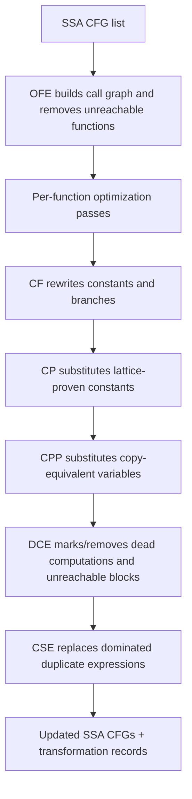
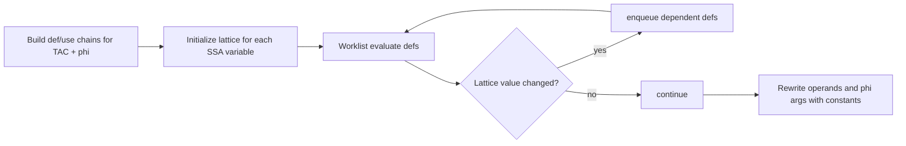

# Optimization

This phase transforms SSA-form CFG/TAC by applying local algebraic rewrites, global dataflow substitutions, dead-code pruning, dominator-scoped redundancy removal, and whole-program orphan function cleanup.

File focus:
- `compiler/src/ir/optimizations/ConstantFolding.java`
- `compiler/src/ir/optimizations/ConstantPropagation.java`
- `compiler/src/ir/optimizations/CopyPropagation.java`
- `compiler/src/ir/optimizations/DeadCodeElimination.java`
- `compiler/src/ir/optimizations/CommonSubexpressionElimination.java`
- `compiler/src/ir/optimizations/OrphanFunctionElimination.java`

## Pass Interaction Model

## Constant Folding (CF)

`ConstantFolding.optimize` has three major steps:
1. `foldArithmeticAndComparisons`
2. `optimizeBranches`
3. `eliminateUnreachableBlocks`

### How CF Actually Rewrites

- Algebraic simplifications first (e.g. `x+0`, `x*1`, `x*0`, `x-x`, `x|0`, `x&1` style identities).
- Full constant evaluation next for `Add/Sub/Mul/Div/Mod/Pow`, boolean bit ops, and `Cmp` relation operators.
- Unary `Not` with constant operand folds to `0/1`.
- Folded results become `Mov dest, Immediate/Literal` while preserving float flags where relevant.

### Branch Canonicalization

- For constant branch conditions, conditional branches are rewritten to either:
  - unconditional `Bra target` when always taken, or
  - branch removal when never taken.
- After rewriting, successor/predecessor edges are patched and dead trailing instructions in block are removed.
- Reachability sweep removes blocks disconnected from entry.

## Constant Propagation (CP)

CP is a def-use worklist analysis with a three-point lattice per SSA variable:
- `TOP`: unknown yet
- `CONSTANT(v)`: proven literal/immediate value
- `BOTTOM`: non-constant or conflicting value

### Transfer Semantics

- `Mov` from immediate/literal yields `CONSTANT`.
- `Mov` from variable copies constant only if source variable is already `CONSTANT`.
- `Phi` meet keeps constant only if all non-`TOP` inputs agree; any conflict yields `BOTTOM`.

### Rewrite Phase

- Replaces TAC operands and phi arguments where lattice says `CONSTANT`.
- Leaves instructions in place; only operands mutate.

## Copy Propagation (CPP)

CPP mirrors CP's framework but uses copy-equivalence lattice values:
- `TOP`
- `COPY(v)` meaning equivalent to variable `v`
- `BOTTOM`

### How CPP Resolves Copies

- `Mov x, y` creates direct copy relation `x -> y`.
- If `y` is already `COPY(z)`, CPP collapses chain to `x -> z`.
- Constants intentionally map to `BOTTOM` (CPP handles only variable copies).
- `Phi` meet keeps copy only when all non-`TOP` operands converge to same source variable.

### Cycle Safety

- Operand replacement follows copy chains recursively with visited-set cycle detection.
- Cyclic copy graphs stop recursion and retain current variable to avoid infinite rewrite loops.

## Dead Code Elimination (DCE)

DCE is use-count-driven elimination with side-effect safety constraints.

### Algorithm

- Build def/use chains for SSA variables (including phi uses).
- Seed worklist with definitions whose results have no users.
- Iteratively mark instructions `eliminated` if they are side-effect-free.
- When an instruction is removed, decrement uses of its input defs; newly dead defs are enqueued.

### Side-Effect Gate

Instructions are never removed if they may affect observable state, including:
- I/O (`Write*`)
- calls/returns
- stores (`Store`, `StoreGP`)
- branches and terminators

### CFG Cleanup

After instruction elimination, DCE runs reachability pruning from entry and removes unreachable basic blocks.

## Common Subexpression Elimination (CSE)

CSE performs dominator-tree-scoped redundancy elimination over pure computation TAC.

### Core Mechanism

- Requires existing dominator analysis from SSA conversion.
- DFS over dominator tree carries an `available expression -> variable` map.
- For each pure computation instruction, compute expression signature.
- If signature already available in dominating context, replace instruction with `Mov dest, existingVar`.
- Otherwise, record current expression as available for dominated descendants.

### Signature Strategy

- Signature encodes instruction opcode and ordered operands.
- Variables include symbol identity and SSA version to avoid aliasing shadowed names.
- `Mov` is excluded from CSE to avoid oscillation with CP/CPP.

## Orphan Function Elimination (OFE)

OFE is interprocedural and runs over the full CFG list.

### How It Works

- Build call graph: each function maps to directly called functions found in `Call` TAC.
- Start BFS from `main`.
- Any function not reachable from `main` is removed from CFG list.
- Transformation log records eliminated function names.

### Important Scope Boundary

- OFE removes whole functions, not instructions or blocks.
- It relies purely on static call edges present in TAC.

## Output Contract

- Output remains SSA-form for each retained function.
- Passes mutate TAC/CFG in place and may mark instructions eliminated or remove unreachable blocks/functions.
- Transformation trace is appended to `record_*.txt`, allowing artifact-backed verification.
