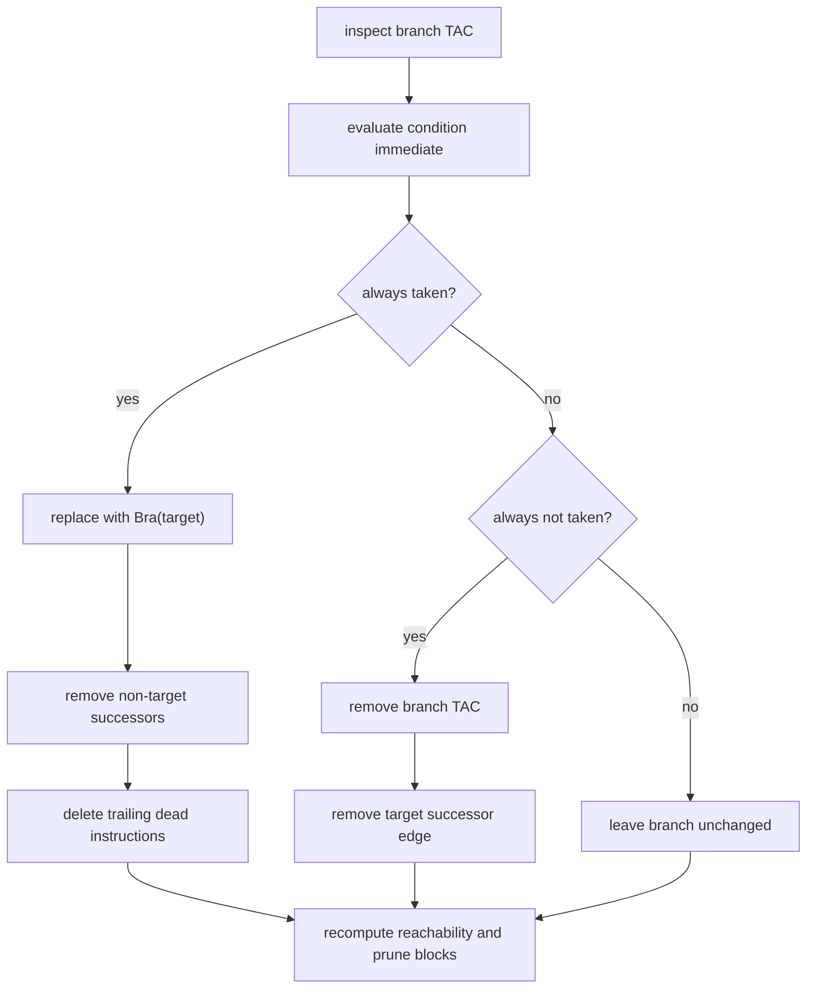
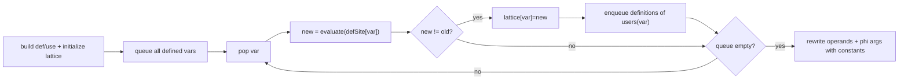
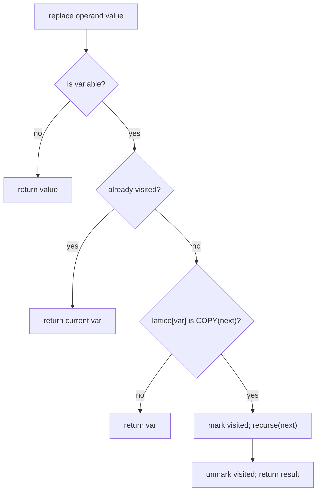
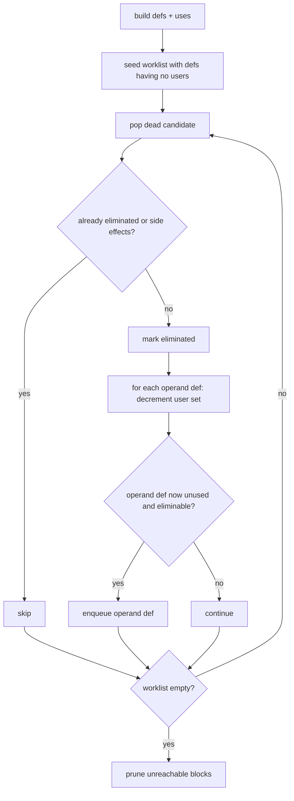
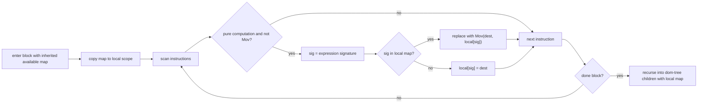
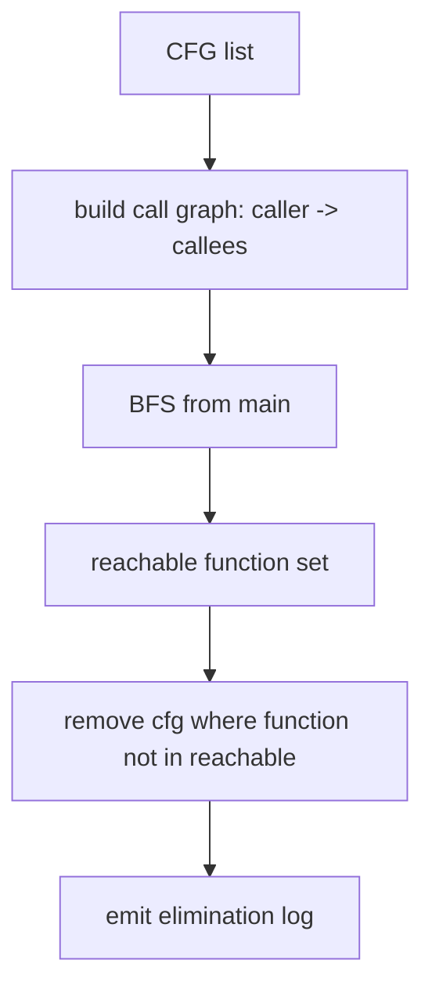

# Optimization Internals

Implementation files:
- `compiler/src/ir/optimizations/ConstantFolding.java`
- `compiler/src/ir/optimizations/ConstantPropagation.java`
- `compiler/src/ir/optimizations/CopyPropagation.java`
- `compiler/src/ir/optimizations/DeadCodeElimination.java`
- `compiler/src/ir/optimizations/CommonSubexpressionElimination.java`
- `compiler/src/ir/optimizations/OrphanFunctionElimination.java`
- shared helpers: `compiler/src/ir/optimizations/BaseOptimization.java`

This document focuses on pass mechanics, transfer rules, mutation points, and algorithm coupling.

## Constant Folding (CF)

Entry: `ConstantFolding.optimize(cfg)`

Pipeline in code:
1. `foldArithmeticAndComparisons`
2. `optimizeBranches`
3. `eliminateUnreachableBlocks`

### Rewrite Rules Actually Implemented

- Algebraic identities (`x+0`, `x*1`, `x*0`, `x-x`, `x/1`, `x%1`, boolean `And`/`Or` identities).
- Full constant evaluation for arithmetic/bitwise and comparisons.
- Unary `Not` fold to `0/1` immediate.
- Folded instructions replaced with `Mov(dest, Immediate/Literal)` preserving float flags when available.

### Branch Surgery

For constant branch conditions:
- rewrite to `Bra target` when always taken,
- remove branch instruction when never taken,
- patch successor/predecessor lists,
- truncate dead trailing instructions in block,
- run entry-reachability block deletion afterward.

## Constant Propagation (CP)

Entry: `ConstantPropagation.optimize(cfg)`

### Lattice And Def-Use Model

Per-variable lattice (`LatticeValue`):
- `TOP`
- `CONSTANT(value)`
- `BOTTOM`

Data structures:
- `defSite: Map<Variable, Object>` where object is TAC or Phi
- `uses: Map<Variable, List<Object>>`
- `lattice: Map<Variable, LatticeValue>`

### Transfer Semantics

- `Mov x, literal/immediate` => `x = CONSTANT(v)`
- `Mov x, y` and `y = CONSTANT(v)` => `x = CONSTANT(v)`
- `Phi` meet keeps `CONSTANT(v)` only if all non-TOP incoming values agree; conflicts produce `BOTTOM`; all-TOP stays `TOP`

### Worklist Engine

Mutation point:
- only operands/phi args are rewritten (`instruction.setOperands`, `phi.setArgs`), instruction kinds remain unchanged.

## Copy Propagation (CPP)

Entry: `CopyPropagation.optimize(cfg)`

CPP mirrors CP architecture but tracks variable equivalence instead of literal constants.

### Lattice

- `TOP`
- `COPY(v)`
- `BOTTOM`

### Transfer

- `Mov x, y` => `x = COPY(y)`
- if `y = COPY(z)`, collapse chain to `x = COPY(z)`
- constants map to `BOTTOM` (CPP is variable-copy only)
- phi meet keeps `COPY(v)` only when all non-TOP incoming copies agree

### Cycle-Safe Replacement

Operand replacement recursively follows copy chains with a visited set.
If a cycle appears (`x -> y -> x`), recursion stops and current variable is preserved.

## Dead Code Elimination (DCE)

Entry: `DeadCodeElimination.optimize(cfg)`

### Core Strategy

- Build def/use chains (`buildDefUseChains` from `BaseOptimization`).
- Seed worklist with defs that have zero users and are side-effect-free.
- Repeatedly eliminate and propagate deadness to their operand definitions.
- Then run unreachable-block elimination from entry.

Side-effect filter (`BaseOptimization.hasSideEffects`) blocks elimination of:
- calls, stores, returns, branches, I/O, terminators.

## Common Subexpression Elimination (CSE)

Entry: `CommonSubexpressionElimination.optimize(cfg)`

Prerequisite:
- `cfg.getDominatorAnalysis()` must exist (produced by SSA conversion).

### Mechanism

- DFS over dominator tree with an `available` map copied per recursion step.
- For each pure computation TAC (excluding `Mov`):
  - build expression signature (`BaseOptimization.getExpressionSignature`)
  - if signature exists in dominating scope, replace with `Mov(dest, existingVar)`
  - else record current destination as available for dominated blocks

Signature includes opcode + operand identity/SSA versions to prevent alias confusion across shadowed symbols.

## Orphan Function Elimination (OFE)

Entry: `OrphanFunctionElimination.eliminateOrphans(cfgs)`

### Whole-Program Algorithm

- Build call graph from every function CFG by collecting `Call` TAC targets.
- BFS/queue reachability from `main`.
- Remove CFGs whose function names are unreachable from `main`.
- Log removed function list in transformation records.

## Coupling And Order Sensitivity

Important interactions in this codebase:
- CF branch rewrites change CFG edges, which changes reachability and future dataflow.
- CP/CPP depend on SSA def-use quality; malformed phi args reduce effectiveness.
- CSE requires dominator tree from SSA stage and uses SSA-version-sensitive signatures.
- DCE relies on conservative side-effect classification from `BaseOptimization`.
- OFE is function-graph-level and independent of block-level rewrite details.

## Output Contract

After optimization stage:
- IR remains SSA form (phis still present).
- Instructions may be replaced, operands rewritten, and some instructions marked eliminated.
- Unreachable blocks/functions may be removed.
- Record files (`record_*.txt`) capture transformation events at instruction granularity.
