# Common Subexpression Elimination (CSE)

Entry: `CommonSubexpressionElimination.optimize(cfg)`

Prerequisite:

- `cfg.getDominatorAnalysis()` must exist (produced by SSA conversion).

## Mechanism

- DFS over dominator tree with an `available` map copied per recursion step.
- For each pure computation TAC (excluding `Mov`):
  - build expression signature (`BaseOptimization.getExpressionSignature`)
  - if signature exists in dominating scope, replace with `Mov(dest, existingVar)`
  - else record current destination as available for dominated blocks

Signature includes opcode + operand identity/SSA versions to prevent alias confusion across shadowed symbols.

```mermaid
flowchart LR
    A["enter block with inherited available map"] --> B["copy map to local scope"]
    B --> C["scan instructions"]
    C --> D{"pure computation and not Mov?"}
    D -- "no" --> E["next instruction"]
    D -- "yes" --> F["sig = expression signature"]
    F --> G{"sig in local map?"}
    G -- "yes" --> H["replace with Mov(dest, local[sig])"]
    G -- "no" --> I["local[sig] = dest"]
    H --> E
    I --> E
    E --> J{"done block?"}
    J -- "no" --> C
    J -- "yes" --> K["recurse into dom-tree children with local map"]
```

