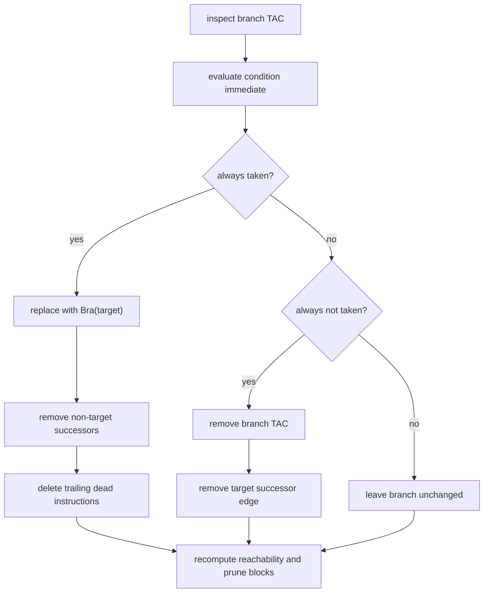

# Constant Folding (CF)

Entry: `ConstantFolding.optimize(cfg)`

Pipeline in code:

1. `foldArithmeticAndComparisons`
2. `optimizeBranches`
3. `eliminateUnreachableBlocks`

## Rewrite Rules Actually Implemented

- Algebraic identities (`x+0`, `x*1`, `x*0`, `x-x`, `x/1`, `x%1`, boolean `And`/`Or` identities).
- Full constant evaluation for arithmetic/bitwise and comparisons.
- Unary `Not` fold to `0/1` immediate.
- Folded instructions replaced with `Mov(dest, Immediate/Literal)` preserving float flags when available.

## Branch Surgery

For constant branch conditions:

- rewrite to `Bra target` when always taken,
- remove branch instruction when never taken,
- patch successor/predecessor lists,
- truncate dead trailing instructions in block,
- run entry-reachability block deletion afterward.

