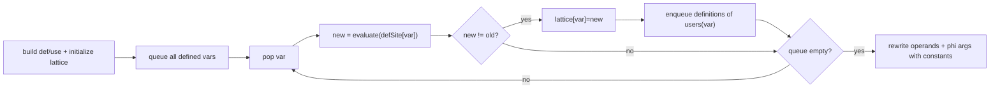

# Constant Propagation (CP)

Entry: `ConstantPropagation.optimize(cfg)`

## Lattice And Def-Use Model

Per-variable lattice (`LatticeValue`):

- `TOP` (Unknown/Uninitialized)
- `CONSTANT(value)` (Known constant)
- `BOTTOM` (Not a constant / Multiple definitions)

Data structures:

- `defSite: Map<Variable, Object>` where object is TAC or Phi
- `uses: Map<Variable, List<Object>>`
- `lattice: Map<Variable, LatticeValue>`

## Transfer Semantics

- `Mov x, literal/immediate` => `x = CONSTANT(v)`
- `Mov x, y` and `y = CONSTANT(v)` => `x = CONSTANT(v)`
- `Phi` meet keeps `CONSTANT(v)` only if all non-TOP incoming values agree; conflicts produce `BOTTOM`; all-TOP stays `TOP`

## Worklist Engine

Mutation point:

- only operands/phi args are rewritten (`instruction.setOperands`, `phi.setArgs`), instruction kinds remain unchanged.
