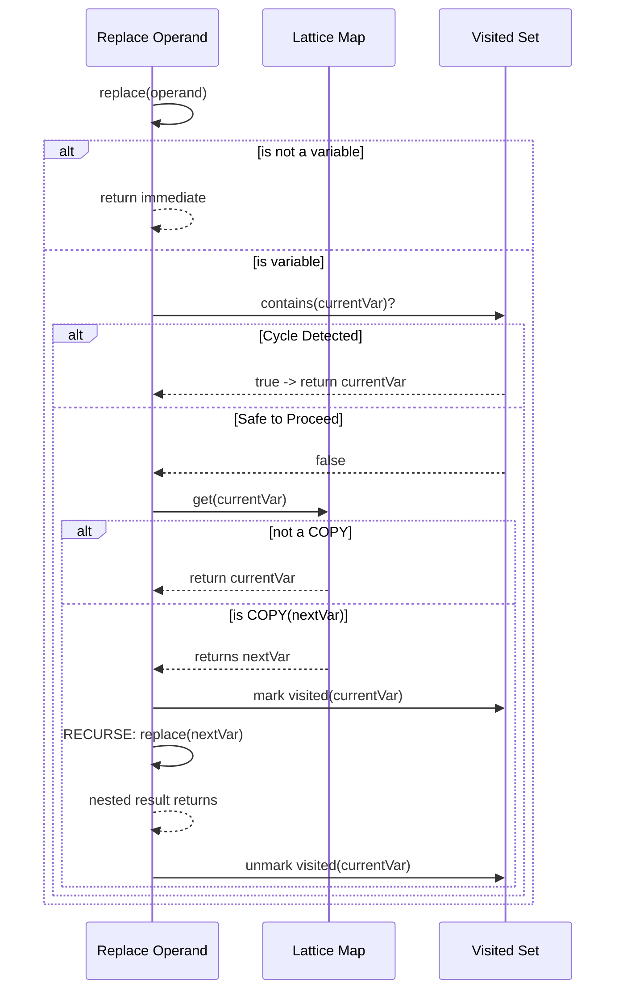

# Copy Propagation (CPP)

Entry: `CopyPropagation.optimize(cfg)`

CPP mirrors CP architecture but tracks variable equivalence instead of literal constants.

## Lattice

- `TOP`
- `COPY(v)`
- `BOTTOM`

## Transfer

- `Mov x, y` => `x = COPY(y)`
- if `y = COPY(z)`, collapse chain to `x = COPY(z)`
- constants map to `BOTTOM` (CPP is variable-copy only)
- phi meet keeps `COPY(v)` only when all non-TOP incoming copies agree

## Cycle-Safe Replacement

Operand replacement recursively follows copy chains with a visited set.
If a cycle appears (`x -> y -> x`), recursion stops and current variable is preserved.

