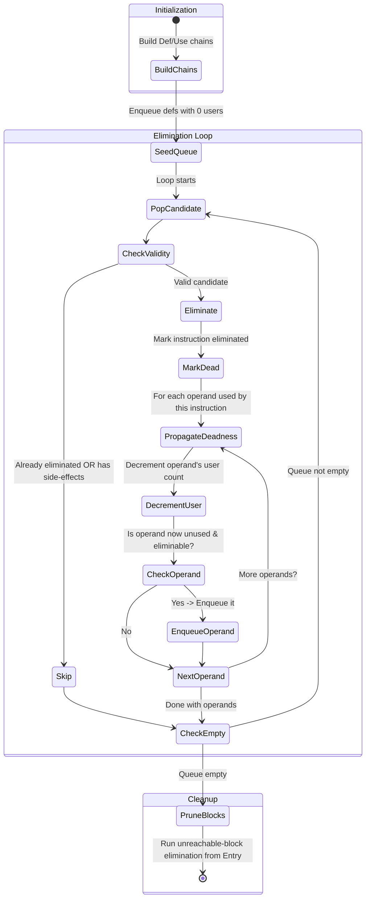

# Dead Code Elimination (DCE)

Entry: `DeadCodeElimination.optimize(cfg)`

## Core Strategy

- Build def/use chains (`buildDefUseChains` from `BaseOptimization`).
- Seed worklist with defs that have zero users and are side-effect-free.
- Repeatedly eliminate and propagate deadness to their operand definitions.
- Then run unreachable-block elimination from entry.

Side-effect filter (`BaseOptimization.hasSideEffects`) blocks elimination of:

- calls, stores, returns, branches, I/O, terminators.

