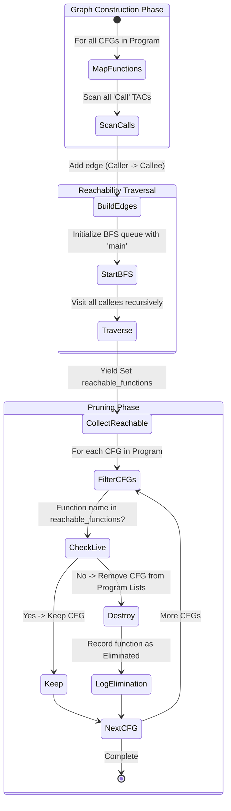

# Orphan Function Elimination (OFE)

Entry: `OrphanFunctionElimination.eliminateOrphans(cfgs)`

## Whole-Program Algorithm

- Build call graph from every function CFG by collecting `Call` TAC targets.
- BFS/queue reachability from `main`.
- Remove CFGs whose function names are unreachable from `main`.
- Log removed function list in transformation records.

