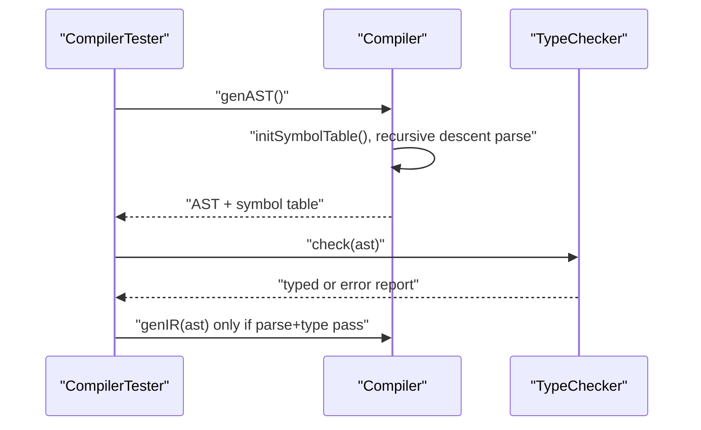

# Parse And Type Check

This stage converts source text into a validated typed AST and blocks invalid programs before IR lowering.

## What Runs

- CLI entrypoint: `compiler/src/mocha/CompilerTester.java`
- Parser/orchestrator: `compiler/src/mocha/Compiler.java`
- Type analysis: `compiler/src/types/TypeChecker.java`

## Execution Flow

## Internal Mechanics

- `CompilerTester` normalizes `-nr` to `[2,24]` before backend stages.
- `Compiler.genAST()` initializes a fresh `SymbolTable`, parses `computation()`, then stores `parsedAST` for reuse.
- Parse failures throw `QuitParseException` and accumulate messages in `errorBuffer`.
- Type checking is a hard gate: `TypeChecker.check(ast)` must pass before IR generation.

## Key Contracts For IR Generation

- Every identifier in AST resolves to symbol metadata.
- Types for expressions and function signatures are established.
- Invalid programs are rejected early with explicit parse/type reports.

## Practical Insights

- Front-end and type-check are separated in the driver, which keeps type diagnostics independent from lowering logic.
- The pipeline is intentionally fail-fast: later stages assume semantic correctness and avoid defensive rechecking.
- `Compiler.genIR(ast)` directly invokes SSA generation (`genSSA`), so the first inspectable IR is already SSA-converted.
