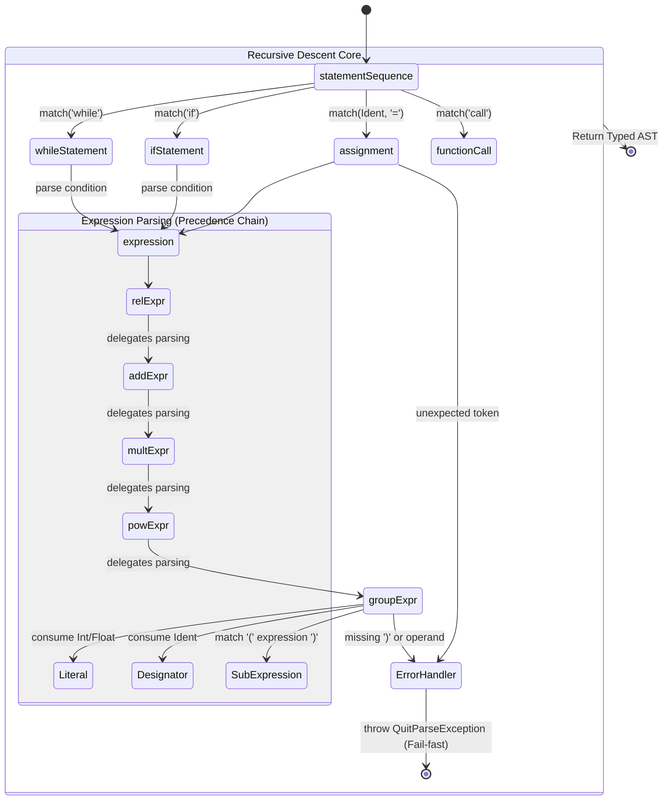
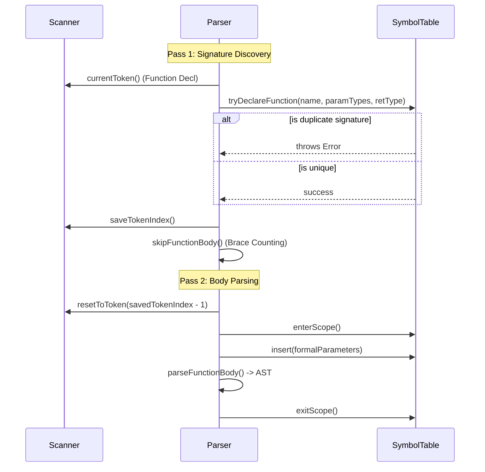
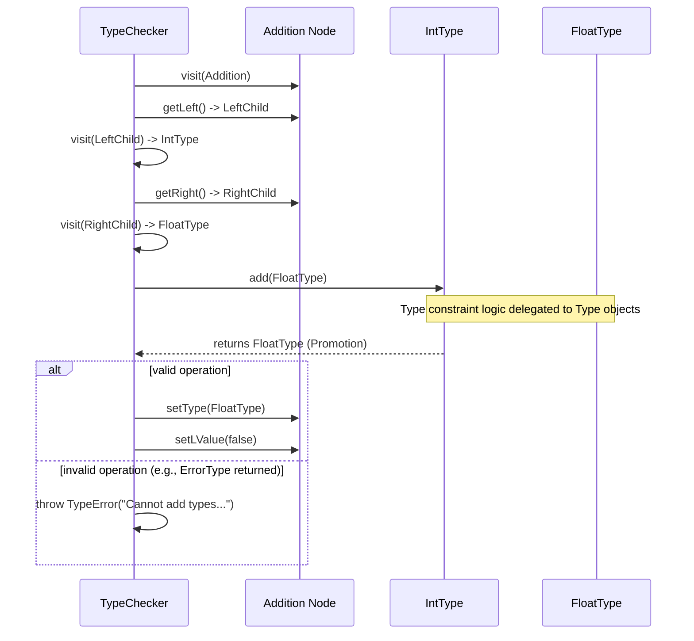

# Parse, Type Analysis, and Front-End Semantics

## The Essence of Parsing and Typechecking

The essence of this phase is **structural validation and semantic labeling**. It bridges the gap between raw text and meaningful computational intent. By rejecting invalid programs early and resolving all references (like variable shadowing and function overloading), it creates a clean, unambiguous foundation. The complexity lies in decoupling the _shape_ of the code (the AST) from the _rules_ of the language (the Type System), ensuring that later stages never have to guess what a variable represents or if an operation is legal.

This document explains how source text becomes a validated AST, how types are enforced, and how `interpret` mode executes that same AST.

Primary files:

- `compiler/src/mocha/Compiler.java`
- `compiler/src/types/TypeChecker.java`
- `compiler/src/mocha/SymbolTable.java`
- `compiler/src/types/*.java`
- `compiler/src/mocha/Interpreter.java`

## Parser Construction Strategy

`Compiler` is a recursive-descent parser with explicit FIRST-set checks (`have(NonTerminal)`) and fail-fast error control (`expect(...)` throws `QuitParseException`).

Expression construction is precedence-layered and creates AST nodes directly at parse time:

- `groupExpr`: literals, designators, calls, parenthesized relation, unary `!`
- `powExpr`: `Power`
- `multExpr`: `Multiplication` / `Division` / `Modulo` / `LogicalAnd`
- `addExpr`: `Addition` / `Subtraction` / `LogicalOr`
- `relExpr`: `Relation`

Designators and arrays are built structurally, not as text rewrites:

- `designator()` starts with `Designator(ident)`.
- Each `[index]` wraps previous base as `ArrayIndex(base, index)`.
- Nested `a[i][j]` becomes a left-nested chain, which later IR lowering uses to compute address steps dimension by dimension.

## Two-Pass Function Parsing And Symbol Resolution

`computation()` parses functions twice to support forward references and mutual recursion.

Key behavior:

- Pass 1 calls `tryDeclareFunction` and skips bodies with `skipFunctionBody()`.
- Pass 2 rewinds scanner (`resetToToken(savedTokenIndex - 1)`) and parses real function bodies.
- Symbol lookup supports overloading via `lookupFunction(name, paramTypes)` in `SymbolTable`.
- Variable lookup is lexical-scope stack search from innermost to global scope.

## Type System Mechanics

`TypeChecker` is a full AST visitor. Every expression node gets:

- `node.setType(...)`
- `node.setLValue(...)`

Operation legality is delegated to type objects (`IntType`, `FloatType`, `BoolType`, `ArrayType`, `FuncType`), for example:

- `leftType.add(rightType)`
- `destType.assign(sourceType)`
- `baseType.index(indexType)`

That keeps operator semantics centralized in `types/*`, not hardcoded per AST node.

## Non-Trivial Checks Performed

Beyond basic operator/type compatibility, the checker enforces several semantic contracts:

- Array dimension validity at declaration (`size > 0`, recursively through nested arrays).
- Compile-time bounds check when index is an integer literal (`arr[99]` against declared size).
- Division-by-zero checks for literal `0` and `0.0`.
- Power constraints for negative literal base/exponent.
- Control conditions must be `bool` for `if`, `while`, `repeat`.
- Function call resolution by exact overloaded signature; emits a precise mismatch error on failure.
- Non-void function path coverage via `guaranteesReturn(...)` (requires all branches in `if` and at least one guaranteed-return path in statement sequence).

## Interpreter Semantics (Front-End Execution Path)

`Compiler.interpret(...)` executes AST directly through `Interpreter`:

- Memory model is `Map<String,Object>`.
- Arrays are flattened to `Object[]` and indexed via computed stride/offset.
- Built-in IO is handled directly (`readInt`, `printFloat`, etc.).
- `LogicalAnd` and `LogicalOr` currently evaluate both sides (no short-circuit).
- User-defined function execution is intentionally minimal in interpreter mode (compile pipeline is the main path for full function/backend behavior).

## Stage Contract To Backend

When this stage succeeds:

- AST is structurally valid and symbol-resolved.
- Expression/result types are attached to nodes.
- Invalid programs are rejected before IR generation.
- Function overload resolution and return-path checks are complete.
