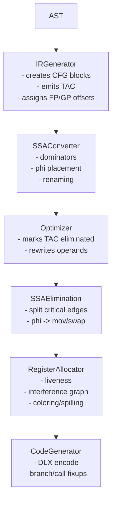

# Pipeline Internals

This document describes the concrete internal flow and invariants enforced between stages.

## Stage Breakdown

## Cross-Stage Invariants

- IR instructions use symbolic `Variable` values until allocation rewrites them to `R*` registers.
- CFG edges in `BasicBlock.predecessors/successors` must match branch instructions.
- Phi nodes must be removed before code generation.
- Codegen assumes every non-immediate operand has a register-backed `Variable` name (`R#`).
- Frame offsets (`fpOffset`) and global offsets (`gpOffset`) are already resolved by IR generation.

## Entry/Exit Contracts

- `IRGenerator.generate` returns function CFG list with entry blocks assigned.
- `SSAConverter.convertToSSA` populates phi nodes and SSA versions.
- `RegisterAllocator.allocate` mutates TAC in place and can inject spill loads/stores.
- `CodeGenerator.generate` returns final `int[]` DLX program and patches fixups before return.

## Related Deep Dives

- `docs/architecture/ir-generator-deep-dive.md`
- `docs/architecture/codegen-deep-dive.md`
- `docs/architecture/technical-debt.md`
