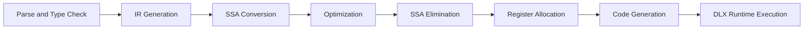

# Pipeline Architecture Overview

This page is the index for architecture documents and the canonical pipeline order.

## Pipeline Order

## Architecture Documents

- `docs/architecture/parse-typecheck.md`
- `docs/architecture/ir-generation.md`
- `docs/architecture/ssa-conversion.md`
- `docs/architecture/optimization.md`
- `docs/architecture/ssa-elimination.md`
- `docs/architecture/register-allocation.md`
- `docs/architecture/code-generation.md`
- `docs/architecture/dlx-runtime.md`

## Cross-Stage Invariants

- CFG predecessor/successor edges and branch TAC targets must remain consistent.
- Phi nodes must be removed before register allocation/codegen consumes TAC.
- Non-immediate operands must map to register-backed variables before codegen.
- Frame/global offsets assigned in IR generation are treated as stable backend contracts.
- Artifacts generated by scripts are written under `artifacts/` rather than source folders.

## Related

- `docs/architecture/limitations.md`
- `docs/optimizations/passes.md`
- `docs/reports/index.md`
