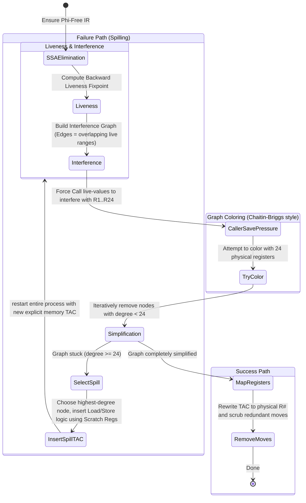

# Register Allocation

## The Essence of Register Allocation

The essence of Register Allocation is **mapping infinite virtual desires to finite physical reality**. The IR assumes it has unlimited variables, but the CPU only has 24 generic registers. This phase uses graph coloring to pack as many non-overlapping variables as possible into hardware. The complexity bubbles up when coloring fails: the allocator must choose a "spill candidate," gracefully evicting it to memory, rewriting all instructions that touch it, and restarting the entire coloring process until the graph fits the machine.

This stage maps virtual variables to physical data registers, injecting spill code when coloring fails.

File focus: `compiler/src/ir/regalloc/RegisterAllocator.java`

## Allocation Loop

## Liveness And Interference

- Computes `liveIn/liveOut` per block with reverse-order dataflow iterations.
- Treats `Store` and `StoreGP` sources as uses so values are preserved in dataflow.
- Builds interference by connecting each definition against currently live values.
- At call sites, live values are forced to interfere with all allocatable registers (`R1..R24`), modeling caller-save pressure.

## Coloring Strategy

- Deterministic node ordering prefers temporaries first, then symbol name/version ordering.
- Simplification picks any node with degree `< numDataRegisters`.
- If simplification fails, returns null and triggers spilling.

## Spill Rewrite Strategy

- Chooses highest-degree node as spill candidate.
- Uses assigned `fpOffset` or `gpOffset` to compute spill address.
- Inserts explicit `Load` before uses and `Store` after defs.
- Uses reserved scratch registers (`R26`, `R27`) for address/value shuttling.
- Repeats full liveness/interference/coloring after each spill rewrite.

## Output Contract

- Backend-visible TAC operands/destinations map to physical register variables (`R#`) for allocatable values.
- Spill memory traffic is explicit TAC for codegen.
- No SSA phi instructions remain.

## Practical Insights

- Spill handling currently supports limited scratch scenarios; high-pressure instructions with too many simultaneous spilled operands can throw.
- Allocation and rewriting are intentionally deterministic to keep output stable for debugging and report comparisons.
- The call-interference modeling is conservative and can increase spill frequency, but protects caller values across calls.
