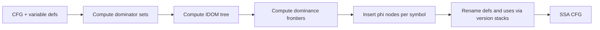

# SSA Conversion

This stage rewrites CFG/TAC into SSA form using dominators, dominance frontiers, phi placement, and versioned renaming.

File focus:
- `compiler/src/ir/ssa/SSAConverter.java`
- `compiler/src/ir/ssa/DominatorAnalysis.java`

## Algorithm Skeleton

## Dominator Analysis Details

- Initializes entry dominators as `{entry}` and all other blocks as `allBlocks`.
- Iteratively intersects predecessor dominator sets to fixpoint.
- Derives IDOM from strict-dominator relationships.
- Builds dominance frontiers by walking predecessors up to each block's IDOM.
- Explicitly handles self-loops by putting a block in its own frontier, enabling loop-carried phi insertion.

## Phi Placement

- For each symbol, start from its definition blocks.
- Traverse dominance frontier worklist.
- Insert one phi per `(block, symbol)` using a `phiPlacedMap` guard.
- Treat newly inserted phis as new defs, so placement can propagate further.

## Renaming Mechanics

- Initialize each symbol with version `v_0` on a stack.
- Walk dominator tree recursively from entry.
- Rename phi destinations first, then instruction uses, then instruction destinations.
- Write incoming phi arguments for each successor from current stack tops.
- Pop pushed definitions in reverse order on recursion unwind.

## Output Contract

- Every use of a variable refers to exactly one SSA definition version.
- Merge points represent incoming values with phi nodes.
- CFG topology is unchanged; only value naming and phi metadata change.

## Practical Insights

- Child traversal is sorted by block number for deterministic renaming order.
- Renaming is instruction-class aware (`Add`, `Cmp`, `Call`, `Load*`, `Mov`, etc.), so new TAC instruction types require SSA rename wiring.
- The self-loop frontier fix is critical for correct loop-variable SSA in `repeat` and similar forms.
