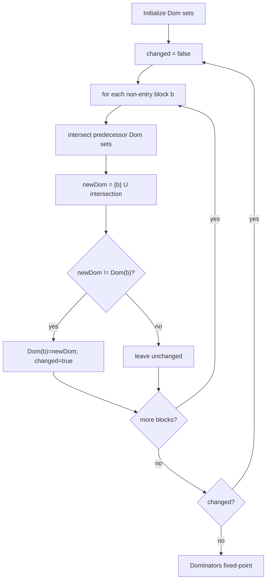
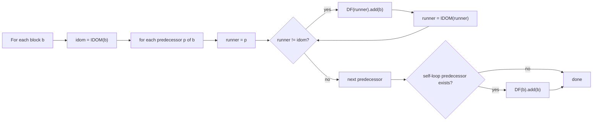
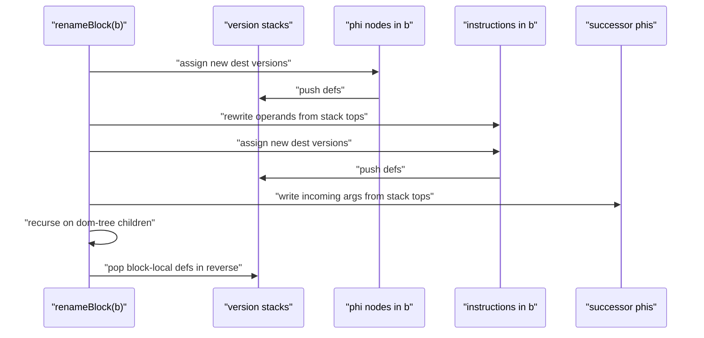

# SSA Conversion

This document describes the exact SSA conversion path implemented in:
- `compiler/src/ir/ssa/DominatorAnalysis.java`
- `compiler/src/ir/ssa/SSAConverter.java`

The implementation is classical in structure, but some details are specific and important: deterministic child ordering, self-loop dominance-frontier handling, and explicit instruction-class destination rewriting.

## Entry Point And State

`SSAConverter.convertToSSA()` does:
1. build dominator analysis (`analyze()`)
2. collect variable definition sites (`findVariableDefinitionsAndCollectSymbols()`)
3. insert phi nodes (`insertPhiNodes()`)
4. rename uses/defs (`renameVariables()`)

Core state in `SSAConverter`:
- `variableDefs: Map<Symbol, Set<BasicBlock>>`
- `variableStacks: Map<Symbol, Stack<Variable>>`
- `variableVersionCounters: Map<Symbol, Integer>`
- `nextInstructionId` for inserted phi instruction IDs

## 1) Dominator Set Fixpoint

`DominatorAnalysis.computeDominators()` initializes:
- `Dom(entry) = {entry}`
- `Dom(b != entry) = allBlocks`

Then iterates until stable:
- `Dom(b) = {b} U (intersection over predecessors p of Dom(p))`

## 2) Immediate Dominator (IDOM) Construction

`computeImmediateDominators()` searches strict dominators of each block and selects the closest one.

Selection logic in this implementation:
- candidate `d` is chosen if `d` is dominated by all other strict dominators of `b`.
- entry has no IDOM.

This yields the dominator tree edges used later by renaming and CSE.

## 3) Dominance Frontier (DF) Construction

`computeDominanceFrontiers()` does two things:
- standard runner-walk from each predecessor up toward IDOM to accumulate join blocks in DF
- explicit self-loop fix:
  - if block has itself as predecessor, add block to its own DF

That self-loop addition is crucial for loop-carried values so phi insertion can occur on repeat/loop back-edges.

## 4) Phi Placement (Worklist Over DF)

`insertPhiNodes(allVars)` is per-symbol worklist insertion:
- seed worklist with all def blocks of symbol `s`
- for each block `x` in worklist, visit `DF(x)`
- if `(frontierBlock, s)` not yet phi-placed:
  - create `Phi` with destination version `-1`
  - insert phi into block
  - treat that block as a new def site by enqueueing it

De-duplication uses `phiPlacedMap: Map<BasicBlock, Set<Symbol>>`.

## 5) Rename Application (DFS On Dom Tree)

Renaming is where the dominator tree gets applied operationally.

### Stack Initialization

For every symbol:
- push initial version `v_0` to stack
- set counter to `0`

### Per-Block Rename Order

`renameBlock(block)` executes in this strict order:
1. rename phi destinations in block (new versions, push)
2. rename uses in regular instructions (replace each variable operand with stack top)
3. rename instruction destinations (new versions, push)
4. fill successor phi incoming arguments using current stack tops
5. recurse to dominator-tree children
6. pop versions created in this block in reverse order (LIFO)

### Why Reverse Pop Matters

The implementation records defs pushed in block-local order and pops reverse order to preserve stack correctness when multiple defs of same symbol occur in one block.

## Instruction Coverage And Mutation Model

Destination rewriting is explicit by TAC subclass (`Add`, `Sub`, `Load*`, `Call`, `Cmp`, `Read*`, etc.).

Implication:
- introducing new TAC classes that define destinations requires updating this rename dispatch, or SSA renaming will become partial/incorrect.

## Determinism And Stability

`DominatorAnalysis.getDomTreeChildren()` sorts children by block number before DFS renaming.

Why this matters:
- deterministic SSA version assignment across runs
- stable optimization/debug artifacts
- easier diffing of generated IR and records

## Output Guarantees

After `convertToSSA()`:
- each variable use references exactly one reaching SSA definition
- merge points are represented by phi nodes with predecessor-keyed arguments
- CFG topology is unchanged; only value naming and phi metadata are rewritten

These guarantees are consumed directly by CP/CPP/CSE and later by SSA elimination.
