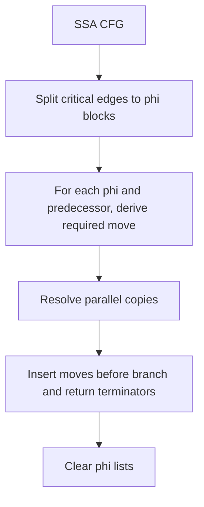

# SSA Elimination

This stage removes phi nodes and converts SSA merges into executable copy sequences on predecessor edges.

File focus: `compiler/src/ir/regalloc/SSAElimination.java`

## Elimination Workflow

## Critical Edge Splitting

- Detect edges where predecessor has multiple successors and successor has multiple predecessors.
- Insert a fresh bridge block with `Bra` to original successor.
- Rewire predecessor/successor links.
- Update branch TAC targets in predecessor.
- Retarget phi argument maps from old predecessor to new bridge block.

## Parallel Copy Resolution

- Collect predecessor-specific moves implied by phi arguments.
- Emit safe moves first when destination is not used as source by other pending moves.
- Detect cycles and break them with `Swap` TAC.
- Skip trivial self-copies.

## Placement Semantics

- Moves are inserted before terminators (`Bra`, conditional branches, `Return`) so both branch paths see correct values.
- After insertion, all phis are removed from block metadata.

## Output Contract

- No phi nodes remain in CFG.
- Value merges are represented by explicit executable instructions.
- CFG structure is valid for liveness/interference analysis.

## Practical Insights

- `nextBlockNum` is static and high-valued to avoid block-id collisions across functions.
- Correct insertion position is a semantic requirement; inserting after terminators would silently break value flow.
- `Swap`-based cycle handling avoids allocating temporary virtuals during phi destruction.
