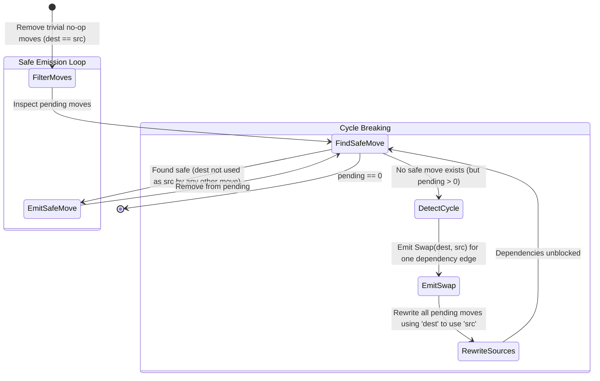

# SSA Elimination Internals

## The Essence of SSA Elimination

The essence of SSA Elimination is **translating hypothetical merges back into physical data movement**. While Phi nodes are mathematically beautiful for optimization, hardware doesn't understand them. This phase bridges the gap by injecting explicit `Mov` instructions onto the CFG edges. The true complexity is resolving "parallel copy" problems—when multiple Phi nodes in a block depend on each other's values in cycles (e.g., swapping two variables). The allocator must untangle these simultaneous logical copies into a safe, sequential execution order without clobbering data.

This pass removes phi nodes by translating merge semantics into explicit edge-local copy code.

Primary file: `compiler/src/ir/regalloc/SSAElimination.java`

## Problem Shape

Each phi in block `B` has the form:

- destination `d`
- map `{ predecessor block -> incoming value }`

At runtime, when control arrives from predecessor `P`, `d` must take exactly the value associated with `P`.

SSA elimination converts that implicit rule into executable instructions inserted on predecessor paths.

## Critical Edge Splitting

Phi-move insertion is unsafe on critical edges (pred has multiple succs and succ has multiple preds), so the pass splits those edges first.

For each critical edge `pred -> succ` where `succ` has phis:

1. Create bridge block `bridge` with `Bra bridge -> succ`.
2. Rewire CFG:
   - replace successor `succ` with `bridge` in `pred`
   - set `bridge` predecessor to `pred`
   - set `bridge` successor to `succ`
   - replace predecessor `pred` with `bridge` in `succ`
3. Retarget branch TAC in `pred` from `succ` to `bridge`.
4. Rewrite each phi argument key from `pred` to `bridge`.

```mermaid
stateDiagram-v2
    state "Original Graph Path" as Before {
        PredBlock --> PhiBlock : Critical Edge (Many Preds, Many Succs)
    }

    state "Graph Transformation (Critical Edge Elimination)" as Split {
        PredBlock --> BridgeBlock : Bra bridge
        note right of BridgeBlock: Inserted Block (Unique ID >= 1000)
        BridgeBlock --> PhiBlock : Fallthrough / Bra
    }

    state "Fixup Routines" as Fixups {
        BridgeBlock --> RetargetBranch : Rewrite PredBlock branches to point to BridgeBlock
        RetargetBranch --> RewritePhiArgs : Rewrite PhiBlock phi incoming-keys from PredBlock to BridgeBlock
    }
```

This guarantees each predecessor path has a unique insertion point for phi-related copies.

## Phi To Move Extraction

For each phi block `B` and each predecessor `P` of `B`:

- Inspect every phi in `B`.
- Read incoming value for `P`.
- Create move if needed:
  - variable source to variable destination when `src != dest`
  - immediate/literal source to variable destination
- Skip trivial self-copy.

Result: a per-predecessor move set representing `P`-specific phi semantics.

## Parallel Copy Resolution

Phi-derived moves are simultaneous logically, but machine instructions are sequential. The pass resolves this with dependency-aware ordering.

Algorithm in `resolveParallelCopies`:

1. Remove no-op moves (`dest == src`).
2. Find a safe move whose destination is not used as a source by any other pending move.
3. Emit safe move and remove it from pending.
4. If no safe move exists, a cycle exists. Break cycle with `Swap(dest, src)` and rewrite pending sources accordingly.
5. Repeat until pending is empty.



This prevents clobbering in cycles like `a <- b, b <- a` without introducing extra virtual temporaries.

## Correct Insertion Point Semantics

Moves are inserted before the first terminator in predecessor block:

- `Bra`
- conditional branches (`Beq/Bne/Blt/Ble/Bgt/Bge`)
- `Return`

Why this exact placement matters:

- If moves were inserted after a branch, they would not execute.
- If block has conditional branch and fallthrough/unconditional branch structure, insertion before the first branch guarantees both outgoing paths observe phi-consistent values.

## Finalization And Invariants

After insertion:

- All phi lists are cleared.
- CFG edges remain valid (including split bridges).
- Value merges are represented entirely by executable TAC.

Additional implementation notes:

- `nextBlockNum` is static and starts high (`1000`) so newly inserted bridge block IDs remain globally unique across CFGs.
- Branch retargeting handles all branch TAC classes, preventing stale control-flow links.
