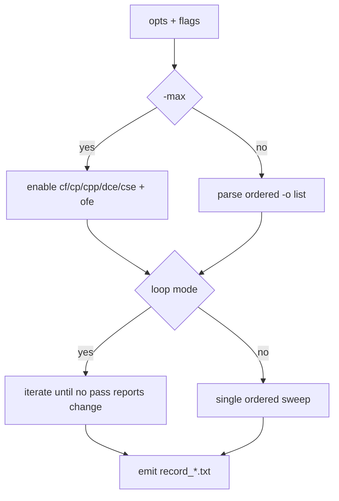

# Optimization Passes

All passes run over SSA-form CFG/TAC unless otherwise noted.

## Implemented Passes

- `cf`: constant folding + algebraic simplification
- `cp`: lattice-based constant propagation
- `cpp`: copy propagation
- `dce`: dead code elimination + unreachable block pruning
- `cse`: dominator-tree common subexpression elimination
- `ofe`: orphan function elimination at CFG-list level

## Driver Behavior

## Internal Mechanics Worth Knowing

- CP tracks `TOP/CONSTANT/BOTTOM` lattice states per SSA variable.
- DCE uses def-use chains and marks TAC as eliminated without immediate physical removal.
- CSE uses expression signatures and replaces duplicates with `Mov` from dominating definitions.
- OFE runs at function graph level and can remove whole CFGs.

## Artifact Signals

- Example CF evidence: `artifacts/records/record_test209-cf_cf.txt`
- Example CFG evidence: `artifacts/graphs/demo_cf_post_cf.dot`

## Current Technical Debt

- Pass ordering and interaction are encoded in imperative logic rather than a declarative pass manager.
- Some transformations rely on instruction-level mutation with limited validation tooling.
- Optimization diagnostics are record-file based; no structured machine-readable trace format yet.
