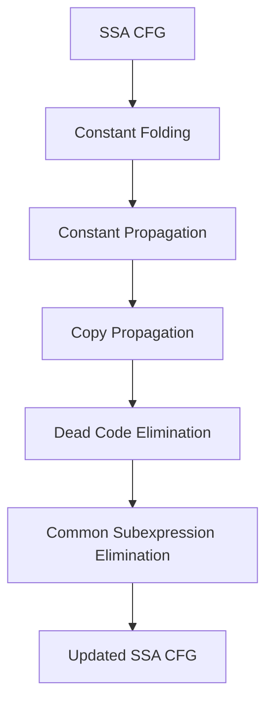

# Optimization Passes

All passes run on SSA-form CFG/TAC before SSA elimination and register allocation.

## Pass Architecture

## Constant Folding (`cf`)

- Combines algebraic simplification with direct constant evaluation.
- Rewrites identities such as `x+0`, `x*1`, `x*0`, `x-x`, and related boolean forms.
- Folds constant `Cmp` relations and unary `Not` to `Mov` with immediates.
- Canonicalizes constant conditional branches to `Bra` or removes always-false branches.
- Performs reachability cleanup after branch rewrites.

## Constant Propagation (`cp`)

- Builds def/use chains over TAC instructions and phi arguments.
- Uses a 3-point lattice per variable: `TOP`, `CONSTANT(v)`, `BOTTOM`.
- Worklist evaluation computes lattice values from `Mov` and `Phi` definitions.
- Rewrites instruction operands and phi args to concrete constants where proven.

## Copy Propagation (`cpp`)

- Uses a copy lattice: `TOP`, `COPY(v)`, `BOTTOM`.
- Tracks variable-to-variable move chains and collapses transitive copies.
- Phi merges keep a copy relation only when incoming copies agree.
- Replaces operands by recursively following copy chains with cycle detection.

## Dead Code Elimination (`dce`)

- Seeds from definitions with zero uses and propagates deadness backward.
- Eliminates only side-effect-free instructions by setting `instruction.eliminated=true`.
- Preserves side-effecting TAC (`Call`, `Store*`, control-flow, I/O, `Return`, etc.).
- Removes unreachable blocks after elimination via entry-reachability walk.

## Common Subexpression Elimination (`cse`)

- Requires dominator analysis from SSA conversion.
- Walks dominator tree with an available-expression map.
- Expression signatures include opcode plus SSA-aware operand identity.
- Replaces dominated duplicate pure computations with `Mov dest, existingValue`.
- Excludes `Mov` from CSE to avoid interaction loops with propagation passes.

## Orphan Function Elimination (`ofe`)

- Builds a function-level call graph from `Call` TAC.
- Starts reachability from `main` and removes unreachable CFGs.
- Works at whole-function granularity, not instruction granularity.

## Artifact Signals

- Example CF evidence: `artifacts/records/record_test209-cf_cf.txt`
- Example CFG evidence: `artifacts/graphs/demo_cf_post_cf.dot`

## Current Limitations

- Pass ordering and interaction are encoded in imperative logic rather than a declarative pass manager.
- Some transformations rely on instruction-level mutation with limited validation tooling.
- Optimization diagnostics are record-file based; no structured machine-readable trace format yet.
